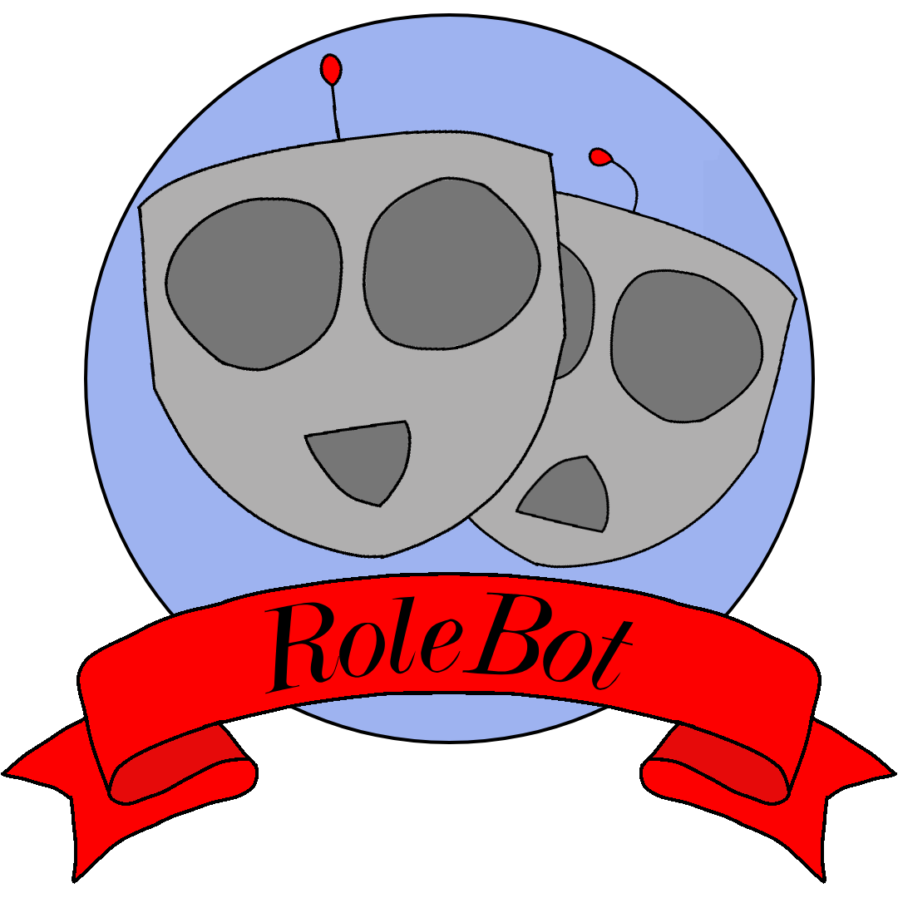

  
<h2>Bring your characters to life, locally!</h2>

RoleBot is a fully local, all-in-one package for developers who want to add AI characters into their Unity projects, without the monthly costs or privacy concerns of traditional cloud-based solutions. It leverages [Unity Sentis](https://docs.unity3d.com/Packages/com.unity.ai.inference@2.6/manual/index.html) and [LLM for Unity](https://github.com/undreamai/LLMUnity) to bring characters to life with local speech detection/transcription, chatbot, and speech sythesis capabilites!

------
### Set-Up

#### Packages
- With Unity open, navigate to `Window > Package Management > Package Manager`
- Click the `+` icon and then select `Install package from git URL`
- Install the most recent version of RoleBot with this URL `https://github.com/TheSevenSages/RoleBot.git`
- Install the LLM for Unity package in the same way: `https://github.com/undreamai/LLMUnity.git`
    - Only required for LLM functionality, if only text-to-speech or realtime speech transcription is desired you may skip this step.

#### Resources
Before you get started you'll need to download some extra resources.
- Navigate to `Window > RoleBot > Download Resources`
- It is recommended to download all of the AI models and at least one voice for text-to-speech.

------
### Known Limitations
- RoleBot is currently only verified for *English*, other languages will likely run into trouble with the current STT and TTS engines.
- The TTS tokenizer does not recognize dates formatted in shorthand (DD/MM/YYYY), you need to write them out instead (ex. October 7th, 2026).

------
### License
RoleBot is distributed with the MIT License([LICENSE.md](LICENSE.md)) and uses third-party software/models with other permissive licenses.

Third-party licenses can be found in the ([Third Party Notices.md](<Third Party Notices.md>)).

Some models that may be downloaded with LLM for Unity define their own license terms, please review them before using each model.
